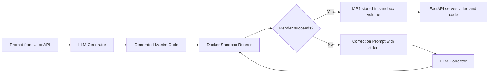

# Text-to-Manim

Text-to-Manim is an open-source agentic pipeline that turns a natural-language explanation request into a rendered Manim animation. It uses an LLM to generate Manim Community code, runs that code inside an isolated Docker sandbox with no network access, retries with a targeted correction loop when rendering fails, and returns an `.mp4` you can watch in the browser. For local testing, it can also generate code through a host-running Ollama instance instead of a cloud API.

## Quickstart

1. Clone this repository and `cd` into `text-to-manim`.
2. Copy `.env.example` to `.env`.
3. Add one provider API key to `.env`.
4. Run `docker compose up`.

## How It Works

## Supported LLM Providers

| Provider | Default Model | Required env var |
| --- | --- | --- |
| Anthropic | `claude-sonnet-4-20250514` | `ANTHROPIC_API_KEY` |
| OpenAI | `gpt-4o` | `OPENAI_API_KEY` |
| Gemini | `gemini-1.5-pro` | `GEMINI_API_KEY` |
| Ollama (local) | `qwen2.5-coder:1.5b` | `OLLAMA_BASE_URL` and `OLLAMA_MODEL` |

## Self-Hosting the Sandbox

Manim rendering in this project runs entirely on CPU inside Docker. For many hobby and internal-use workloads, this is practical on a small VPS, and a typical self-hosted deployment can fit comfortably in roughly the `$5-$20/month` range depending on provider, storage, and expected render volume.

The sandbox path is designed to keep host resource usage bounded: render containers run with no network, capped memory/CPU, a tmpfs-backed `/tmp`, and automatic pruning of old job directories in `sandbox/volumes`.

## Contributing

To add new few-shot patterns, open `prompts/examples.py`, add a new `Example(prompt=..., code=...)` entry, keep the code compatible with Manim Community, and prefer short scenes that demonstrate a reusable animation pattern rather than a one-off visual flourish. New examples should preserve the `GeneratedScene(Scene)` class contract because the sandbox runner invokes that class name directly.

